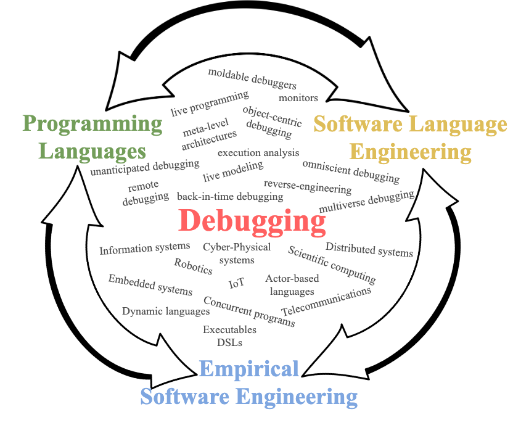

# Bienvenue sur le site du GT debugging

Ce GT a pour objectif de rassembler dans une même communauté tout chercheur, ingénieur, équipe industrielle ou du GDR qui s'intéresse aux problèmes du debugging logiciel.
Il s'inscrit dans la communauté du GDR Génie de la Programmation et du Logiciel (GPL) du CNRS.

## Objectifs du GT

Nous nous intéressons aux défis de la conception et de l'implémentation d'outils de debugging, à leur généralisation et à leur évaluation empirique.

Il n'y a pas de méthode unique pour comprendre et résoudre des bugs, car cela dépend du domaine d'application, des contraintes posées sur le logiciel lui même (par ex. dans l'industrie) ou encore des bugs eux mêmes (certains bugs étant plus difficiles que d'autres à comprendre).

Le GT oriente sa recherche autour de trois axes complémentaires.

1. Au travers d'études empiriques nous voulons explorer et comprendre les besoins et les défis du debugging sur les champs d'application étudiés par les différentes équipes du GT : la robotique, l'IOT, le big data, les IHM, les langages dédiés exécutables, le scientific computing, les langages à acteurs, les langages dynamiques, les systèmes distribués et concurrents, etc.

2. Pour répondre au défis mis en lumière nous définissons, explorons ou approfondissons de nouvelles méthodes et techniques de debugging, par exemple et de manière non-exhaustive : l'analyse d'exécution, le reverse-engineering, le remote-debugging, le debugging centré-objet, les architectures réflexives, le back-in-time debugging, le live modeling, etc.

3. Enfin, nous étudions comment implémenter et généraliser les méthodes et techniques mises au point dans des outils utilisables et évaluables empiriquement. Ce dernier point est crucial, étant donné la difficulté notoire de créer des outils applicables sur des cas réel, de leur évaluation (c'est-à-dire : est-ce que ça marche vraiment ?) et de la reproductibilité des expériences.

# Organisation

Nous souhaitons favoriser et à maximiser les collaborations entre les membres participants, notamment au travers du partage d'expertises : on pense à l'implémentation d'outils, à leur application à d'autre cas et à leur généralisation, et aux évaluations empiriques.

Un des objectifs est de structurer la communauté Française du debugging pour la rendre visible et la mettre en avant à l'international, en proposant des appels à contributions pour des numéros spéciaux de revues internationales sur le debugging (Science of Computer Programming, Journal of Object Technology, The Art, Science and Engineering of Programming, etc.) ou des organisations de workshops dans les conférences importantes du domaine (ICSE, SPLASH, SLE, DLS, etc.).

Les équipes participantes à l'origine de la proposition du GT réunissent différentes expertises scientifiques qui couvrent tout le spectre problème-évaluation-étude-implémentation-généralisation de l'axe scientifique du GT, comptant des industriels (Thales) et des équipes internationales (Université de Chicoutimi au Québec et VUB Bruxelles). Le spectre du GT debugging reste large et transversal à d'autres GT, du point de vue domaine applicatif ou des méthodes étudiées. Notre objectif est également de vulgariser les problèmes scientifiques cachés sous l'aspect appliqué du debugging et de rassembler les différents acteurs du GDR rencontrant et étudiant ces problèmes.

## Responsables du GT

* Steven Costiou, CR Inria, Lille (https://kloum.io/costiou/)
* Benoît Combemale, PR Université de Rennes (https://people.irisa.fr/Benoit.Combemale/)

## Contact et participation

Tout membre du GDR DPL est bienvenu pour participer, ainsi que tout industriel ou chercheur international.

- Inscrivez vous sur la liste debugging@inria.fr (https://sympa.inria.fr/sympa/info/debugging)
- Si vous souhaitez joindre le groupe en tant qu'équipe, merci de vous inscrire sur la liste et d'y envoyer les informations suivantes:
  * Nom de l'équipe, localisation, laboratoire si judicieux, type d'équipe (académique, industrielle, internationale)
  * Nombre de permanents de l'équipe impliqués dans le GT
  * Représentant de l'équipe pour le GT
  * Expertise et intérêts scientifiques dans le cadre du GT

## Animation

- Workshops (1 à 2 par an)
  - Organisés par RMoD/Inria et SOFT/VUB (Brussels)
  - Présentation des papiers récents déjà publiés en conférences
  - Présentation et échanges autours des recherches en cours
  - Discussions et réflexions autour des problèmes et des défis du debugging
  - Ateliers : code dojos, tutoriaux...
  -  Publication de rapports techniques résumant les workshops
- Collaborations et partage d'expertises (via une mailing list dédiée)
- Serveur de discussion public (à venir)
- Appels à contributions sur numéros spéciaux de revues internationales
- Proposition de workshops dans les conférences internationales du domaine

# Équipes

8 équipes participent aujourd'hui au GT, dont 2 équipes internationales et 1 équipe industrielle.
29 membres permanents de ces équipes ont déclaré leur participation, et 13 thèses sont en cours ou en démarrage sur les thèmes abordés par le GT.

Les équipes participates sont les suivantes:

#### Équipes du gdr-gpl

**RMoD, Inria, Univ. Lille, CNRS, Centrale Lille, UMR 9189 - CRIStAL (Lille)**
* Nombre de permanents impliqués dans le GT: 6
* Représentant dans l'équipe: Stéphane Ducasse (DR Inria)
* Expertise et intérêts scientifiques dans le cadre du GT : supports réflexifs pour le debugging, outillage, back-in-time debugging, debugging à la volée, langages dynamiques.

**CERI Systèmes Numériques, IMT Lille Douai, Douai**
* Nombre de permanents impliqués dans le GT: 2
* Représentant dans l'équipe: Luc Fabresse (PR)
* Expertise et intérêts scientifiques dans le cadre du GT : reflection to support advanced debugging techniques and tools, remote debugging, cross-languages debugging (transpilation chains, etc.)

**DiverSE, IRISA (Rennes)**
* Nombre de permanents impliqués dans le GT: 3
* Représentant dans l'équipe: Benoit Combemale (PR)
* Expertise et intérêts scientifiques dans le cadre du GT : domain-specific debugging, debugging for scientific computing, model execution and analysis

**NaoMod, LS2N (Nantes)**
* Nombre de permanents impliqués dans le GT: 3
* Représentant dans l'équipe : Erwan Bousse (MCF)
* Expertise et intérêts scientifiques dans le cadre du GT : langages dédiés exécutables, débogage de modèles exécutables, débogueurs pour langages dédiés (DSLs)

**MOCS, Lab-STICC (Brest)**
* Nombre de permanents impliqués dans le GT: 2
* Représentant dans l'équipe : Alain Plantec (PR)
* Expertise et intérêts scientifiques dans le cadre du GT : mécanismes réflexifs pour le ciblage et l'adaptation d'objets contextuellement défectueux, modélisation et patrons pour l'adaptation dynamiques

#### Équipes internationales

**SmArtSE, Laboratoire d'Informatique Formelle (LIF), Chicoutimi, Québec, Canada**
* Nombre de permanents impliqués dans le GT: 2
* Représentant dans l'équipe: Fabio Petrillo (Associate Professor)
* Expertise et intérêts scientifiques dans le cadre du GT : études empiriques sur le debugging (programme Swarm Debugging).

**Soft, Software Language Lab, Vrije Universiteit Brussels, Bruxelles**
* Nombre de permanents impliqués dans le GT: 7
* Représentant dans l'équipe: Elisa Gonzales Boix (Professor)
* Expertise et intérêts scientifiques dans le cadre du GT : debugging for multicore and distributed systems, online debugging, record & replay debugging, back-in-time debugging, multiverse debugging,  meta-level architectures for debugging, optimizations and zero-overhead infrastructure for tools and debuggers, actor-based languages

#### Équipes industrielles

**UX Prototyping Team, THALES DMS, Brest, France**
* Nombre de permanents impliqués dans le GT: 4
* Représentant dans l'équipe: Dr. Éric Le Pors (Team Leader)
* Expertise et intérêts scientifiques dans le cadre du GT : Debugging d'IHM, debugging concurrent, back-in-time debugging.
